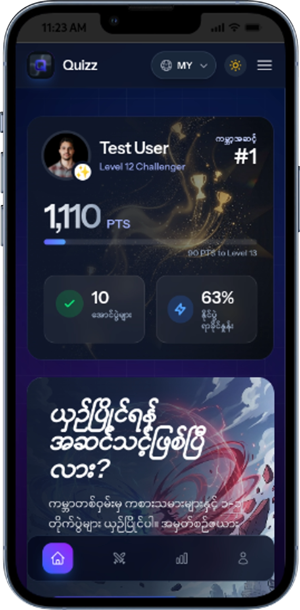
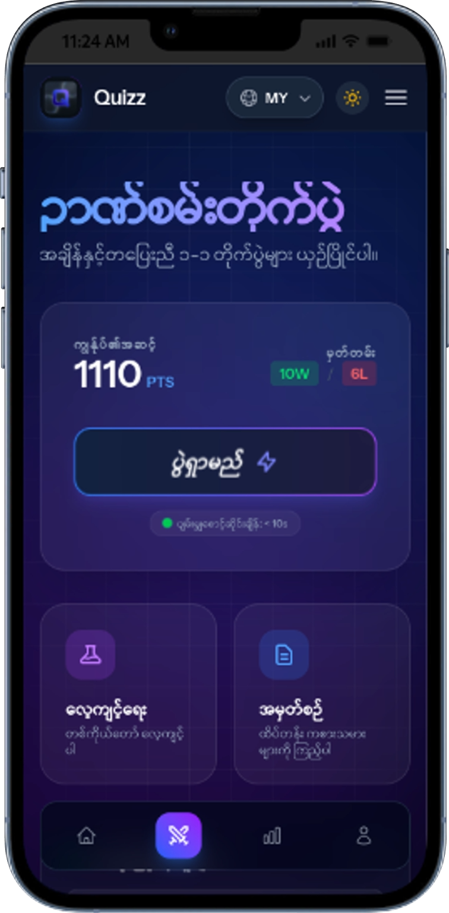
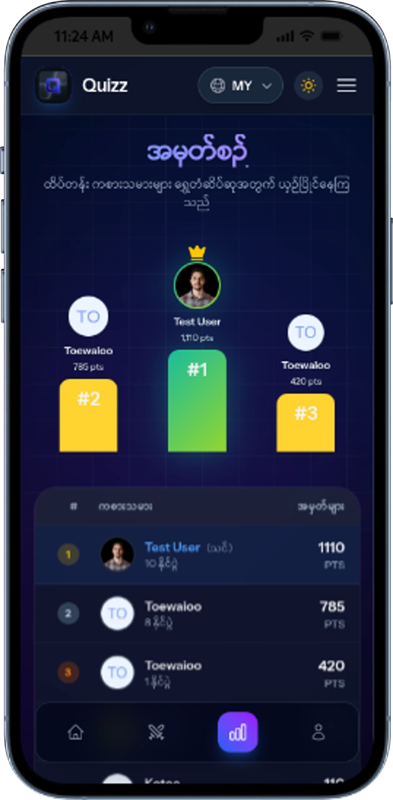
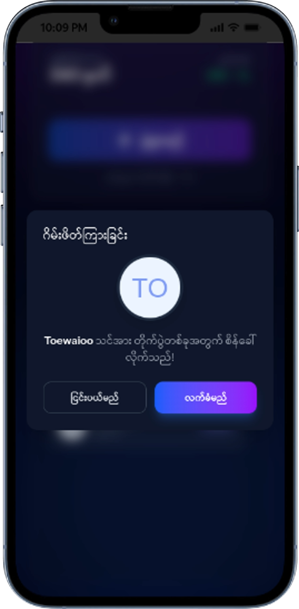
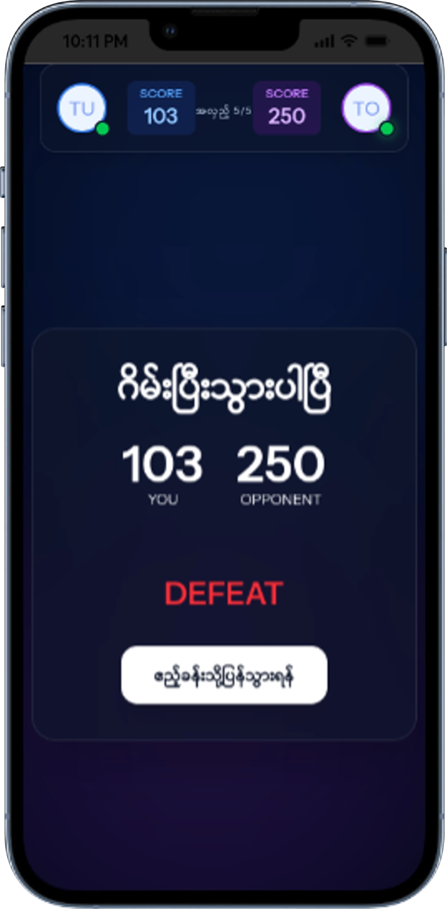

# ⚡ Quizz - Master the Arena


**Quizz** is a next-generation competitive quiz platform that blends real-time multiplayer battles with user-centric design and AI-generated content. Built for speed and engagement, it allows players to challenge friends or random opponents in 1v1 knowledge battles, climb global leaderboards, and track their progress with detailed statistics.







---

## 🚀 Key Features

### ⚔️ Real-Time 1v1 Arena
*   **Instant Matchmaking**: Find opponents in seconds with our optimized WebSocket-based lobby system.
*   **Live Synchronization**: Experience lag-free gameplay powered by **Ably**, ensuring millisecond-level state sync between players.
*   **Dynamic Scoring**: Points decay over time (15s per question), rewarding speed and accuracy.
*   **Competitive Limits**: Only proven players (10+ points) can enter the Arena to ensure quality matches.

### 🧠 AI-Powered Content
*   **Smart Seeding**: Hybrid database system combining curated real-world questions with AI-generated localization.
*   **Bilingual Support**: Fully localized interface and questions in **English** and **Burmese**.

### 🎨 Modern & Responsive UI
*   **Glassmorphism Design**: A premium, translucent aesthetic using the latest Tailwind CSS 4.0 techniques.
*   **Animated Backgrounds**: Immersive, unparalleled visual experience with interactive 3D elements and pulsing gradients.
*   **Light & Dark Mode**: Fully adaptive themes that look stunning in any lighting condition.
*   **PWA Support**: Installable on mobile and desktop as a native-like application.

### 🏆 Social & Progression
*   **Global Leaderboard**: Compete for the top spot based on points, wins, and win ratios.
*   **User Profiles**: Customizable profiles with photo uploads (image cropping & compression included).
*   **Lobby System**: See who's online, invite friends, and challenge active players directly.

---

## 🛠 Tech Stack

### Backend
*   **Framework**: [Laravel 12](https://laravel.com) (PHP 8.2+)
*   **Database**: SQLite (Dev) / MySQL (Prod)
*   **Real-time**: [Ably](https://ably.com) (WebSockets)
*   **Storage**: [Supabase](https://supabase.com) (S3-compatible object storage for avatars)
*   **Authentication**: Laravel Sanctum
*   **Documentation**: Swagger / L5-Swagger

### Frontend
*   **Framework**: [React 19](https://react.dev)
*   **Routing**: [Inertia.js 2.0](https://inertiajs.com)
*   **Styling**: [Tailwind CSS 4.0](https://tailwindcss.com) & [Headless UI](https://headlessui.com)
*   **Animations**: [Framer Motion](https://www.framer.com/motion/)
*   **Icons**: Heroicons & Lucide React
*   **Utilities**: `date-fns`, `browser-image-compression`, `react-image-crop`

---

## ⚡ Installation & Setup

Follow these steps to get the project running on your local machine.

### Prerequisites
*   PHP >= 8.2
*   Node.js >= 20
*   Composer
*   Ably Account (API Key)
*   Google Gemini API Key
*   Supabase Project (URL, Key, Bucket)

### 1. Clone the Repository
```bash
git clone https://github.com/toewaioo/Quizz.git
cd Quizz
```

### 2. Install Dependencies
```bash
# Backend dependencies
composer install

# Frontend dependencies
npm install
```

### 3. Environment Configuration
Copy the example environment file and update it with your credentials:

```bash
cp .env.example .env
```

Edit `.env` and configure the following:

```ini
APP_NAME=Quizz
app_url=http://localhost:8000

# Database
DB_CONNECTION=sqlite or pgsql

# Realtime (Ably)
ABLY_KEY=your_ably_api_key

# AI (Google Gemini)
GEMINI_API_KEY=your_gemini_api_key

# Storage (Supabase)
FILESYSTEM_DISK=supabase
SUPABASE_URL=your_supabase_url
SUPABASE_API_KEY=your_supabase_key
SUPABASE_BUCKET_NAME=your_bucket_name
```

### 4. Initialize Application
```bash
# Generate App Key
php artisan key:generate

# Create SQLite Database
touch database/database.sqlite

# Run Migrations
php artisan migrate
```

### 5. Seed Database
Populate the database with initial questions and categories:

```bash
# Fetch questions from external APIs/AI
php artisan seed:fetch-questions

# Seed the database
php artisan db:seed --class=QuestionSeeder
```

### 6. Run the Application
Start the development servers in two separate terminals (or concurrently):

```bash
# Start Laravel Server
composer run dev
```
*Note: The `dev` script uses `concurrently` to run both PHP and Vite servers.*

Visit `http://localhost:8000` in your browser.

---

## 📂 Project Structure

```
Quizz/
├── app/
│   ├── Http/Controllers/  # Game, Profile, & API logic
│   ├── Services/          # Ably, Gemini, & Supabase integrations
│   └── Models/            # User, Question, Quiz models
├── resources/
│   ├── js/
│   │   ├── components/    # Reusable UI components (GlassCard, Button, etc.)
│   │   ├── pages/         # Full pages (Welcome, Dashboard, Arena, Lobby)
│   │   └── hooks/         # Custom React hooks (usePresence, useDebounce)
│   └── css/               # Tailwind entry point
├── routes/                # Web and API routes
├── database/              # Migrations and Seeders
└── public/                # Static assets and build output
```

## 📄 License

This project is open-sourced software licensed under the [MIT license](https://opensource.org/licenses/MIT).
